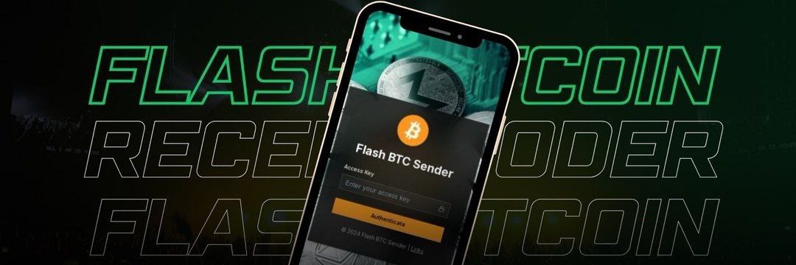

	

# Flash USDT

Project updates and Android app information for Flash USDT are shared through the community channels below.

> **Unofficial project:** Flash USDT is not affiliated with, endorsed by, or issued by Tether. USDT is a trademark of its respective owner.

## Project banner

The repository banner and intended Open Graph/social preview image are both [`.github/banner.jpg`](.github/banner.jpg).

## Links

- **Project updates and support:** [Telegram admin](https://t.me/gniaxx)
- **Community:** [Sheikh Coders on Telegram](https://t.me/SheikhCoders)

## Safety

- Verify the source and authenticity of any software before installing it.
- Never share your wallet password, private key, or recovery phrase with anyone or enter it into a project access form.
- Digital assets involve risk. This repository does not promise profits, guaranteed transfers, or changes to blockchain transaction records.
